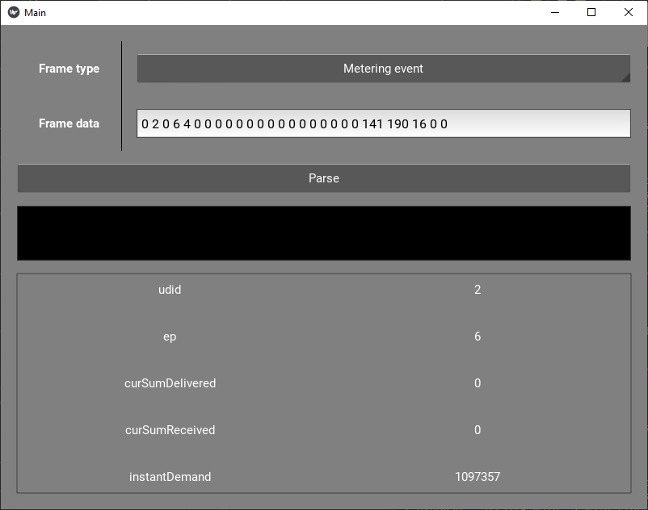

# FutureHome NCP frame parser
A GUI application for easily parsing frames received from the NCP on FutureHome hub.



## Setup and usage
_Note: tested on Windows and MacOS using Python 3.9._

```sh
# Create a new virtual environment
python3 -m venv venv
# Source it:
# On MacOS/Linux/WSL
source venv/bin/activate
# On Windows - Powershell
powershell Set-ExecutionPolicy RemoteSigned
./venv/Scripts/Activate.ps1
# On Windows - Git Bash
source venv/Scripts/activate
# Install the needed packages
pip3 install -r requirements.txt
# Run
python3 main.py
```
